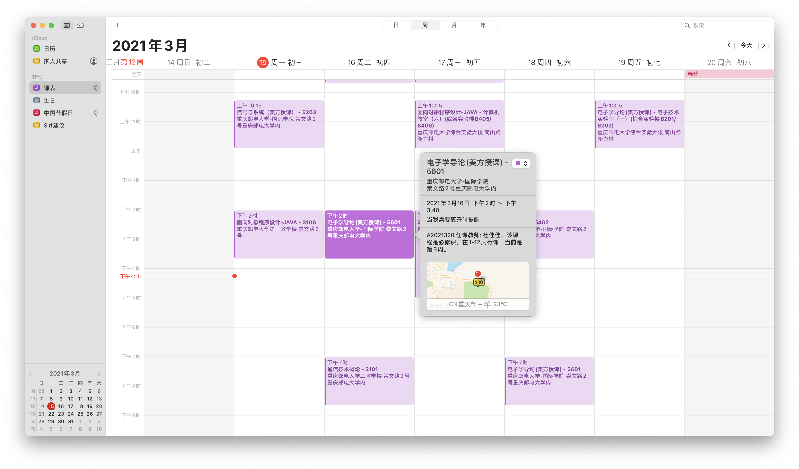
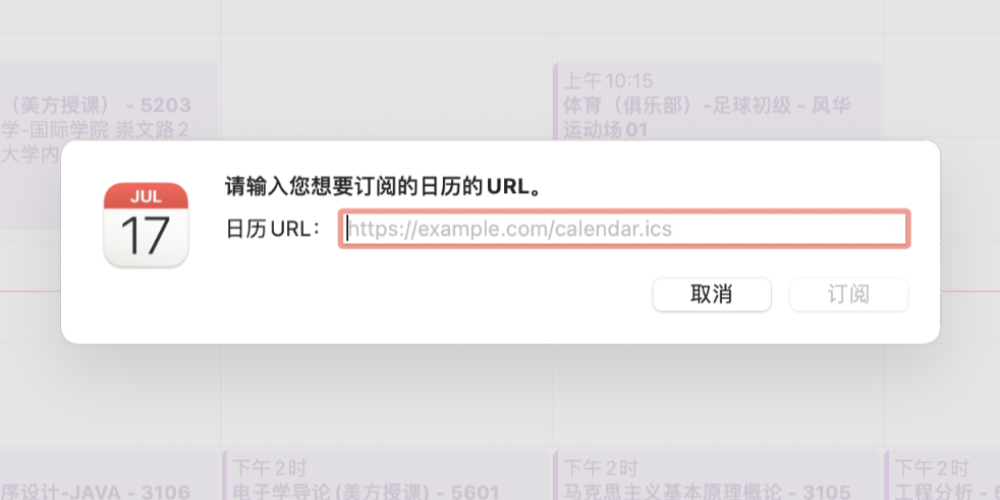

## CQUPT-ics

**重庆邮电大学学生课表 iCal (.ics) 自动生成工具。支持创建日历订阅，支持教学楼定位。**

如果你非重庆邮电大学学生，请访问 [python-ical-timetable](https://github.com/junyilou/python-ical-timetable) 项目，可手动生成学生课表。



\-

## 为什么使用 iCal

iCalendar 是广泛使用的日历数据交换标准，在诸如 Apple 日历、Google Calendar 的日历 app 中创建日历项，不仅可清晰的了解日程安排，更可体验 iOS、Android 系统为日历提供的各种功能：计划出行时间、日程提醒、如 Siri 与 Google Assistant 等智能语音助理自动化服务等。

例如，在 iOS 设备中添加日历项后，你可以直接向 Siri 询问：「我下周五有什么日程？」获得下周五的课表；或是在 Apple Watch 表盘上显示下一个课程的时间；或是使用 Shortcut 捷径进行更多操作。


通常我们查询课表，可能会打开教务在线，或是 We 重邮、掌上重邮等服务，这不仅较为耗费时间，也无法享受上述系统级服务和功能。

本程序现支持多种数据源，当前已经接入的有：
- 重庆邮电大学红岩网校开发的「掌上重邮」app 数据源  
- 蓝山工作室开发的「We重邮」小程序数据源  

如果您是开发者，您也可以为本程序开发数据源，[点此](docs/providers.md)查看文档。

只需个人学号，即可生成你的全部课程、考试日历，输出为 iCal (.ics) 文件。

\-

## 功能

#### 无需其他信息，只需提供学号

仅通过学号，即可自动获取所有课程、考试信息，也可选择仅课程或仅考试。

#### 支持匹配教学楼具体名称和地址

显示具体的教学楼名称在日历项位置中。目前支持逸夫楼、理学院、综合实验楼、部分体育场馆、1, 2, 3, 4, 5, 8 教学楼，以及一个上述场所均未匹配时可以使用的 Fallback。

#### 支持日历 GPS 定位

如果你使用 Apple 日历，将自动匹配教室的定位信息。这方便了 iOS 自动建议出行时间信息、显示日历项于 Apple 地图中及 Shortcut 捷径等其他与地理信息相关的服务。Apple 日历适用于 iOS、iPadOS、watchOS 和 macOS 及 iCloud 设备。

#### 支持对比课表之间的差异

启用此功能后，运行将记录课表，稍后再次运行代码时将自动对比记录的课表与新获得的课表之间的差异，并生成一个 DIFF 差异页面，供你了解如教室、教师、周数的变化，轻松获得调停课信息。

#### 自动获取本学期的校历信息

代码将从当前校历周分析出校历第一周日期，以此为起点生成课表，通常无需手动指定本学期的起始时间。

但有些极为特殊的时候，程序可能不能正常分析。这时候你也可以自行指定，方法见下方说明。

\-

## 使用

#### 运行环境

* 本代码需要使用 **Python 3**。

* 依赖于 [requests](https://github.com/psf/requests) 库，最简单的方式是使用 pip 安装。

  ```
  pip3 install -r requirements.txt
  ```

* 服务器版还依赖于 [Flask](https://github.com/pallets/flask) 库，最简单的方式是使用 pip 安装。

  ```
  pip3 install -r requirements_server.txt
  ```

#### 运行

**只需要在终端中传入学号，即可正常运行。**
**默认输出到 stdout，可以通过 `-o` 参数指定，例如**

```
python3 cli.py -o cqupt.ics 2020xxxxxx
```

可以通过传入 `-h` 或 `--help` 参数查看更多帮助。

若需要手动指定学期开始的第一个周一的日期，请传入 `--start-day` 参数，并使用 `YYYY-MM-dd` 格式，例如：

```
python3 cli.py -o cqupt.ics 2020xxxxxx --start-day 2020-03-01
```

对于生成的 .ics 文件，通常只需打开即可导入（Windows、macOS、Android），对于 iOS 和 iPadOS 用户，需使用 AirDrop 将文件传到设备，或者想办法通过 Safari 浏览器访问此文件。

\-

## 服务端使用与日历订阅

对于进阶用户，你可能有自己的服务器，希望运行此代码，自动获得最新的课表并创建 iCalendar 订阅，这样，你的设备也将定期向服务器刷新课表，自动获得课表更新。

本代码完全兼容服务端使用，经测试，**Apple 日历、Google Calendar、Outlook Calendar 均支持本代码生成的 ics**，同样也支持订阅本代码生成的 ics。



因此，你可以直接运行 `wsgi.py` 或通过 uWSGI 运行这个程序，或者使用 Docker 镜像。你可以通过 `START_DAY` 环境变量传入 `YYYY-MM-dd` 格式的开学日期以防不能正常获取。启动后，你只需请求 `/<学号>.ics` 即可。

例如：
```
http://127.0.0.1:2021/2020xxxxxx.ics
```

一些 GET 参数：
 * `class`: 默认为 1，传入 0 可去除课程
 * `exam`: 默认为 1，传入 0 可去除考试信息
 * `geo`: 默认为 1，传入 0 可去除定位信息

**iOS 和 iPadOS 用户**：要添加日历订阅，请打开「设置」—「日历」—「账户」—「添加账户」—「其他」—「添加已订阅的日历」，然后在「服务器」中输入 ics 的 URL 地址。通过 Safari 直接打开 ics 的 URL 地址**只会导入**此日历中的全部日历项到已有的日历中，不会创建日历订阅。

\-

## 问题反馈与联系

* 看作者的课表来找作者
* 直接提交 Issue
* Telegram [@shunitsu](https://t.me/shunitsu) 或 [@qwqVictor](https://t.me/qwqVictor)