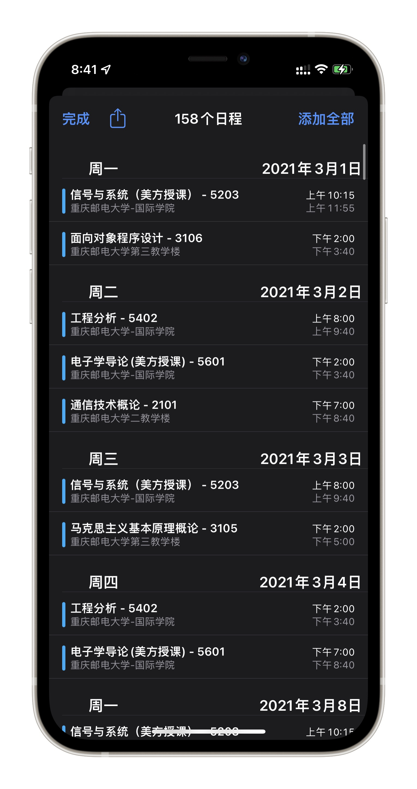
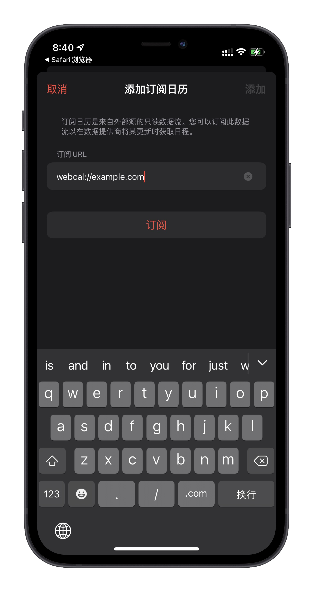
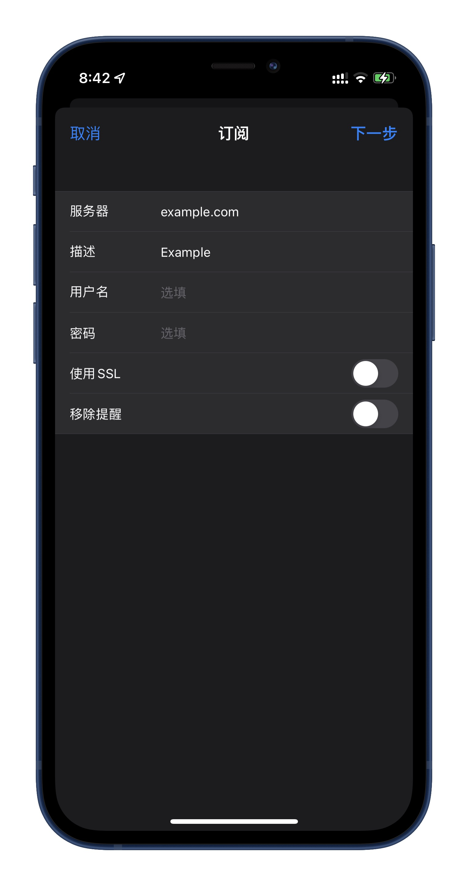

### 1. 关于导入日历和订阅日历

### 2. 导入与订阅在 Apple 设备的操作方法


#### 名词释义

**导入日历**

导入日历是一次性行为，生成 ics 并导入日历后，日历 app 将仅保留 ics 文件中的日历项。在需要变更日历时，可能需要先移除已有的日历项，再重新导入新的日历。

其特点是数据一经导入后**便进行存档**，并且，你可以随时在日历 app 中**修改日历项的内容**，例如调整日历项的时间、地点、标题、内容等等。

导入日历相当于是复制了 ics 中的日历项并创建到你的日历当中。

**订阅日历**

订阅日历是一个只读行为，你需要向日历 app 提供日历（ics 文件）的地址，日历 app 将自动定时请求这一地址，以检查日历有无发生变更，并在变更时自动将更新的日历同步到你的日历 app 中。

其特点是数据随远程 ics 文件的变化而变化，并且，日历项完全由 ics 文件决定，你不能**修改日历项的任何内容**。

订阅日历的好处是，只要服务端的日历变更，日历 app 中的数据便会获得同步变更。


#### iOS、iPadOS 用户

##### 导入日历

要导入日历，你需要在 iOS、iPadOS 上设法打开 ics 文件，较为简单的方法是：（iOS 与 iPadOS 相同）

* 如果你有 Mac 等其他 Apple 设备并支持 AirDrop，将 ics 文件 AirDrop 到需要导入日历的 iOS 设备即可；
* 如果你使用 iOS 自带的邮件 app，将 ics 作为附件发送邮件给设备，并点击附件中的 ics 文件；
* 如果你有网络服务器，或有办法将 ics 上传到一个网站上，使用 Safari 浏览器打开链接到 ics 文件的地址；

导入的界面类似下图



点击「添加全部」按钮，将会导入所有日历项到你的日历当中。

**注意！若你只有一个日历**（日历是容纳日历项的地方，iOS 支持创建多个日历），点击「添加全部」将直接添加到你的唯一日历中，此日历可能包含了你的其他日历项，直接添加到默认日历可能造成后续删除课表极为不便（难以进行批量删除）。

强烈建议首先创建一个空白日历，此后点击「添加全部」，iOS 会提示你选择导入的日历，选择空白日历有利于后续进行批量管理。

##### 订阅日历

要订阅日历，你必须将 ics 放在一个固定可访问的 URL 地址，这可能要求你有可控制的 Web 服务器。

iOS 提供两种方式订阅日历，其中前者支持将订阅同步到 iCloud 设备，而后者不支持：

* 方式一（支持同步订阅信息到 iCloud）

  打开 Safari 浏览器，并输入如下地址：

  ```
  webcal://<你的 ics 地址>
  ```

  例如：

  ```
  webcal://exmaple.com/example.ics
  ```

  将提示跳转至 日历 app，点击继续，你将看到类似如下界面：

  

  点击「订阅」，你可以设置禁用提醒、是否同步到 iCloud 等，设置完成后点击添加即可。

  若你选择同步到 iCloud，你的 Mac 等其他 Apple 设备同样将自动订阅此 ics 文件。

* 方式二（不推荐）

  打开「设置」—「日历」—「账户」—「添加账户」—「其他」，

  选择「添加已订阅的日历」，输入 ics 文件的 URL，你将看到类似如下界面：

  若你的 URL 不支持 SSL，将会弹出 SSL 安全提示，是否启用 SSL 并不影响使用。

  

  最后点击下一步即可完成添加，请注意以此方式添加的日历订阅无法被 iCloud 同步。

  要在其他设备上添加日历订阅，需在对应设备重复进行此步骤。


#### macOS 用户

打开「日历」app，点击「文件」—「新建日历订阅」，并按指示进行即可。

若在创建订阅时勾选 iCloud，订阅将在 iCloud 设备中同步。